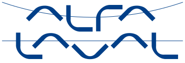
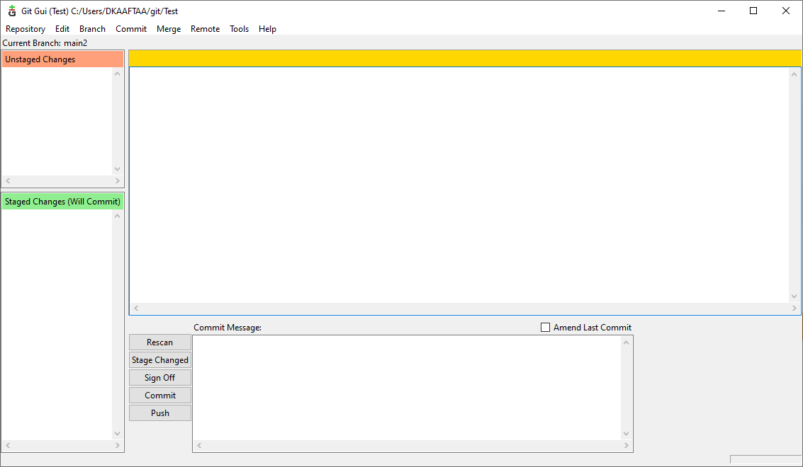

# Introduction to Git 
Mechanical & Thermal Engineering 
Frederik Thorsted 

---

# Agenda

- Background
- What is Git
- Benefits of using Git
- Branching 
- Working with Git

<!-- Feel free to ask questions -->

---
# Background
- Local program development
  - Select access to programs
- Need for tracebility 
- Need for review 
- Need for integrity

---
# What is Git?

- Free and Open-Source software for version control (SCM) 
- Fully distributed
- Able to handle large projects 
- Make 'project specific' programs 

Current uses for Git: 
- MATLAB files
- Python files
- OpenFOAM case files
- EES files 
- More to come 

---

# Benefits of using Git 

- Control changes
- Adding tracebility
- Review of code
- Create custom programs without modifying exiting code 
- Ability to use already familiar tools 

---
# Git branching 

---
# Working with Git

- Git GUI
- Git bash
- Local and remote repository
- Gitignore

<!-- Not all operations necessary -->
<!-- Staging is used to separate commits into diffentent commits -->

---
<!-- # Live

 -->

---
# Resources 
- Git book: https://git-scm.com/book/en/v2
- https://www.atlassian.com/git/tutorials/using-branches/git-checkout

